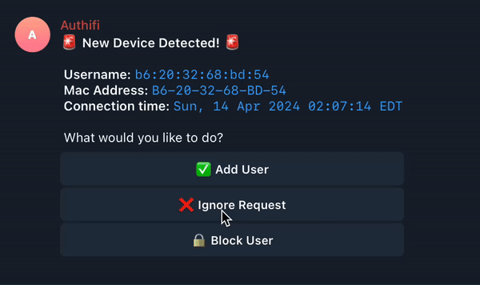

# 🛜 Authifi

## Introduction
Hey there! Authifi is a simple tool for easier MAC-based VLAN assignment on Unifi routers. It’s designed to be user-friendly and straightforward, with a Telegram bot for easy control and notifications.

Every time a new device connects to your network, Authifi can automatically assign it to a default VLAN and ask you what to do next via Telegram. You can then choose to assign the device to a different VLAN for future connections or block it entirely.

## Why Authifi?
If you're like me you've probably tried to set up dynamic VLANs on your Unifi network only to find that it doesn't support default VLANs. Every time you want to add a new device, you must first find its MAC address somehow, then go to the Unifi controller and manually assign it to a VLAN. It's a hassle, especially if you want to add IOT or guest devices quickly.

Authifi solves this problem by letting you define a default VLAN for new devices and letting you quickly assign other VLANs or block devices in real-time from Telegram.




## Key Features
- **Default VLANs:** Assign new devices to a default VLAN automatically.
- **Per-Device VLANs:** Assign specific VLANs to devices on the fly.
- **Telegram Bot Integration:** Control and receive updates directly on your phone in real-time.
- **YAML Database:** Love it or hate it, it's dead simple to use and understand.
- **Lightweight:** Authifi is a tiny 8MB binary that won't even tickle your server's resources.

## Quick Start Guide
Follow these steps to get Authifi up and running with the minimum fuss.

Tested on a Unifi Cloud Gateway Ultra and a MacBook Pro M2.

### Step 1: Create Your Telegram Bot
1. **Chat with BotFather:** Send `/newbot` to @BotFather on Telegram.
2. **Set a name and username for your bot,** and receive your bot token.

### Step 2: Find Your Telegram Chat ID
1. **Use a bot like @userinfobot** to send `/start` and get your chat ID.

### Step 3: Generate a RADIUS Secret
1. The RADIUS secret can be any secure string you choose. You can generate one online or simply run:
```bash
openssl rand -hex 16
```

### Step 4: Decide the IP and Port for Authifi
1. If you're deploying directly on your Unifi Gateway, you can use its IP in the default VLAN. Otherwise, choose a VLAN IP of the machine where you'll run Authifi. For example, if you're running on your Unifi Gateway and your default VLAN is `192.168.1.1/24` you should use `192.168.1.1`. If you're not sure, you can bind to all interfaces with `0.0.0.0`, but you'll eventually need to know the specific IP when configuring your Unifi Gateway to use Authifi's RADIUS server.
2. Next decide on a port for Authifi's RADIUS server. The default is port for RADIUS servers is usually `1812`, but I recommend using a different port to avoid conflicts with other services. For example, you could use `1815` or another port that's not in use.

### Step 5: SSH into your device
1. If setting up on Unifi, follow these steps to SSH into your device: https://help.ui.com/hc/en-us/articles/204909374-UniFi-Connect-with-Debug-Tools-SSH

### Step 6: Navigate to the folder wherein you want to install Authifi
1. This can be any folder you choose. If on Unifi, I recomment `/data` via the command `cd /data`

### Step 7: Run the installation script
1. Run the following command to download and install Authifi:
```bash
bash -c 'bash -c "$(curl -sL https://raw.githubusercontent.com/Maronato/authifi/main/install.sh)"'
```
2. Follow the script prompts to configure Authifi with your details.

### Step 8: Add your VLANs to the database
1. A new directory called `authifi` will be created in the folder you ran the script. Inside this directory, you'll find a `database.yaml` file. Open this file and add your VLANs and users as needed.
2. Here's an example with basic VLANs. Remember that these must be the VLANs and their IDs as they appear in your Unifi controller. The `name` doesn't have to match, just make sure the `id` is correct.
```yaml
users: []
vlans:
  - id: "1"
    name: "🛜︎ Default"
  - id: "10"
    name: "🏠 Main"
  - id: "20"
    name: "🤖 IOT"
  - id: "30"
    name: "🧳 Guest"
    default: true
blocked: []
```

### Step 9: Restart Authifi to apply changes
Authifi tries to track changes to the database in real-time, but in my experience it's a bit flaky on Unifi due to the Network "app" being run inside a container. You can trigger a service restart by running:
```bash
systemctl restart authifi
```

### Step 10: Configure your Unifi Gateway
Now that Authifi is running, you need to configure your Unifi Gateway to use Authifi as its RADIUS server. Here's how:
1. Open your Unifi Controller and navigate your Network settings.
2. Click on "Profiles" and then "RADIUS".
3. Create a new RADIUS profile with the following settings:
   - **Name:** Authifi
   - **Wired Networks:** _Check_
   - **Wireless Networks:** _Check_
   - **Authentication Servers:** Add a new server with the following details:
     - **IP Address:** The IP address you chose for Authifi
     - **Port:** The port you chose for Authifi
     - **Shared Secret:** The secret you generated in Step 3
4. After saving, click on "WiFi" on the left sidebar and edit your WiFi network:
   - **RADIUS MAC Authentication:** Enable and then select the Authifi profile you created.
   - **MAC Address Format:** Can be whatever you prefer

You can also configure it as a 802.1X profile for wired networks. Authifi should work anywhere you need to use a RADIUS server.

### Step 11: Test it out!
Connect a new device to your network and see if you receive a Telegram notification. You can then assign it to a different VLAN or block it.


## Database file structure
The database file is a simple YAML file that you can edit with any text editor. Here's a breakdown of the structure:

```yaml
users: # A list of the users you've registered through Authifi
  - username: "a1:23:45:67:89:ab" # This will usually be the MAC address of the device, but you can create regular RADIUS users too
    password: "a1:23:45:67:89:ab" # This will usually be the MAC address of the device, but you can create regular RADIUS users too
    vlan: "30" # The VLAN ID to assign to this user
  - username: "b1:23:45:67:89:ab"
    password: "b1:23:45:67:89:ab"
    vlan: "20"

vlans: # A list of the VLANs you've defined in your Unifi controller
  - id: "1" # The VLAN ID as it appears in your Unifi controller
    name: "🛜︎ Default" # The name of the VLAN as you want it to appear in Authifi
  - id: "10"
    name: "🏠 Main"
  - id: "20"
    name: "🤖 IOT"
  - id: "30"
    name: "🧳 Guest"
    default: true # (Optional) Set this to true to make this the default VLAN for new devices. Only one VLAN can be the default.
  
blocked: # A list of the devices you've blocked from your network
  - "c1:23:45:67:89:ab"
  - "d1:23:45:67:89:ab"
```

## Configuration
You can configure Authifi via its configuration file, environment variables, or command-line flags. You can run `authifi --help` to see all available options, but here are the most important ones:

| Option                      | Description                                                                                           | Default         |
| --------------------------- | ----------------------------------------------------------------------------------------------------- | --------------- |
| `--config`, `-c`            | Path to the configuration file                                                                        | Optional        |
| `--host`, `-h`              | The IP address to bind the RADIUS server to                                                           | `localhost`     |
| `--port`, `-p`              | The port to bind the RADIUS server to                                                                 | `1812`          |
| `--radius-secret`, `-s`     | The shared secret for the RADIUS server                                                               | Undefined       |
| `--telegram-token`, `-t`    | The Telegram bot token                                                                                | Undefined       |
| `--telegram-chat-ids`, `-i` | A chat ID to send notifications to. Declare it multiple times to send notifications to multiple chats | Undefined       |
| `--database-file`, `-f`     | The path to the database file                                                                         | `database.yaml` |
| `--verbose`, `-v`           | The verbosity level of the logs                                                                       | `0`             |
| `--quiet`, `-q`             | Disable all logs.                                                                                     | `false`         |

Besides command line flags and the config file, you can also set environment variables to configure Authifi. Simply prefix the flag with `AI_` and use uppercase letters. For example, `--host` becomes `AI_HOST`, or `--telegram-token` becomes `AI_TELEGRAM_TOKEN`.

## Building from Source
Building is the same as any Go project. You can clone the repository and run `go build` to create the binary. You can also use the provided `Makefile` to build and install the binary.

```bash
git clone https://github.com/maronato/authifi.git
cd authifi
make build
```

## Troubleshooting
If you run into any issues, first enable access logs in your configuration file by setting `verbose 1`. This will log all incoming requests and responses to the console. Don't forget to restart the service after making changes with `systemctl restart authifi`.

If you can't track down the issue, you can enable debug logging by setting `verbose 2`. This will log a few more details that might help you track down the problem.

## Disclaimer
Authifi is a personal project and can be great for individual or experimental use, but it’s not built for critical systems. Use at your own risk.

## Contributing
Feel free to dive in! Contributions, forks, and stars are all welcome.

## License
Authifi is distributed under the MIT license. See `LICENSE` for more information.
